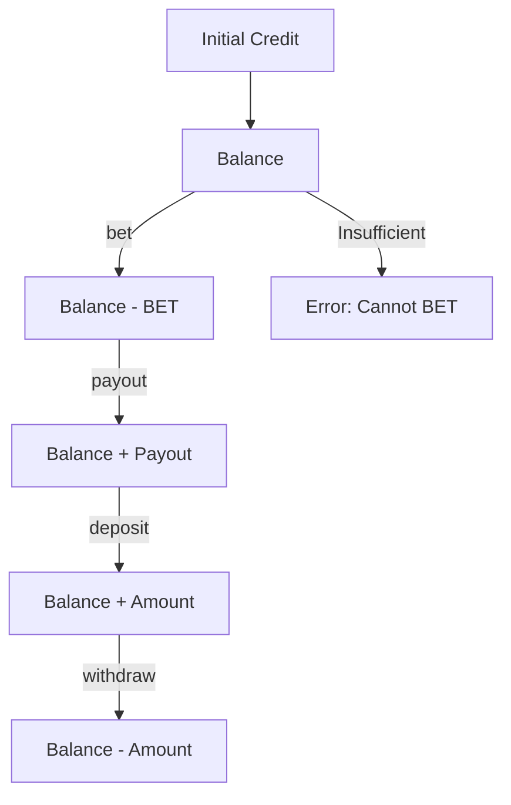

import { Meta } from '@storybook/blocks';

<Meta title="Docs (EN)/Credit Manager" />

# Credit Manager

`CreditManager` handles all credit (medal) operations: balance tracking, BET consumption, payout, deposit, and withdrawal.

## Operations Flow



## BetConfig

| Field | Description |
|-------|-------------|
| `initialCredit` | Starting balance |
| `betOptions` | Available BET amounts (e.g. `[1, 2, 3]`) |
| `defaultBet` | Default BET amount |
| `historySize` | Number of history entries to keep |

## Usage

```tsx
import { useCredit } from 'reeljs';

const { balance, currentBet, canSpin, setBet, deposit, withdraw } = useCredit({
  initialCredit: 1000,
  betOptions: [1, 2, 3],
  defaultBet: 3,
});
```
