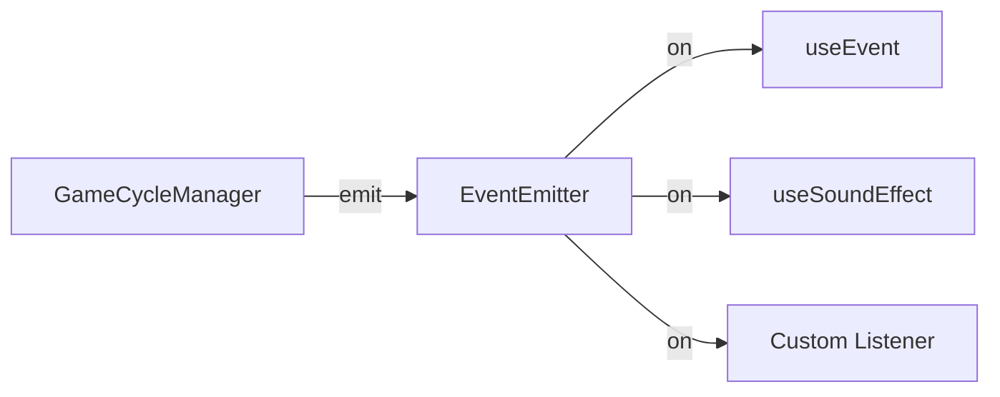

import { Meta } from '@storybook/blocks';

<Meta title="Docs/Event System" />

# Event System

`EventEmitter` provides a pub/sub event bus for decoupled communication between modules.

## Standard Events

| Event | Payload | Fired When |
|-------|---------|------------|
| `spinStart` | — | Spin begins |
| `reelStop` | `{ reelIndex, position }` | A reel stops |
| `win` | `{ payout, winLines }` | Win detected |
| `bonusStart` | `{ bonusType }` | Bonus mode starts |
| `modeChange` | `{ from, to }` | Game mode changes |
| `zoneChange` | `{ from, to }` | Zone changes |
| `phaseChange` | `{ from, to }` | Game phase changes |
| `creditChange` | `{ balance, delta }` | Credit balance changes |
| `notification` | `NotificationPayload` | Notification fires |

## Architecture



## Usage

```tsx
import { useEvent } from 'reeljs';
import { EventEmitter } from 'reeljs';

// Direct usage
const emitter = new EventEmitter();
const unsub = emitter.on('win', (payload) => console.log(payload));
emitter.emit('win', { payout: 100 });
unsub(); // or emitter.off('win', listener)

// Hook usage (auto-cleanup on unmount)
const { emit, on } = useEvent(emitter);
on('win', (payload) => { /* handle */ });
```
