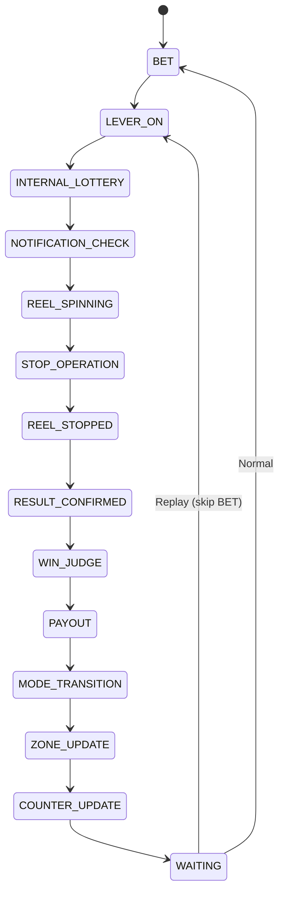

import { Meta } from '@storybook/blocks';

<Meta title="Docs/Game Cycle Manager" />

# Game Cycle Manager

`GameCycleManager` orchestrates the full lifecycle of a single game round through 14 phases.

## Phase Flow



## Phase Responsibilities

| Phase | Module Called |
|-------|-------------|
| BET | CreditManager |
| INTERNAL_LOTTERY | InternalLottery |
| NOTIFICATION_CHECK | NotificationManager |
| REEL_SPINNING | SpinEngine |
| WIN_JUDGE | Payline Evaluator |
| PAYOUT | CreditManager |
| MODE_TRANSITION | GameModeManager |
| ZONE_UPDATE | ZoneManager |
| COUNTER_UPDATE | SpinCounter |

## Usage

```tsx
import { useGameCycle } from 'reeljs';

const { currentPhase, isReplay, startCycle } = useGameCycle(config);
```
