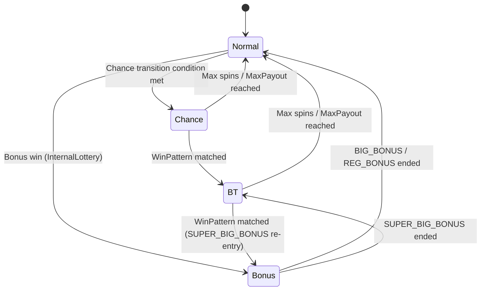

import { Meta } from '@storybook/blocks';

<Meta title="Docs (EN)/Game Mode Transition" />

# Game Mode Transition

Reeljs manages four game modes via `GameModeManager`: **Normal**, **Chance**, **Bonus**, and **BT** (Bonus Trigger).

## Transition Diagram



## Mode Overview

| Mode | Entry Condition | Exit Condition |
|------|----------------|----------------|
| Normal | Game start / Bonus end | Chance or Bonus triggered |
| Chance | `normalToChance` probability | WinPattern → BT, or max spins |
| Bonus | InternalLottery BONUS win | Max spins or MaxPayout |
| BT | SUPER_BIG_BONUS end / Chance WinPattern | Max spins or MaxPayout |

## Usage

```tsx
import { useGameMode } from 'reeljs';

const { currentMode, currentBonusType, remainingSpins } = useGameMode({
  transitionConfig: { normalToChance: 0.02, chanceTobt: 0.3, btToSuperBigBonus: 0.1 },
  bonusConfigs: { /* ... */ },
  btConfig: { maxSpins: 50, maxPayout: 500, winPatterns: [] },
  chanceConfig: { maxSpins: 20, maxPayout: 200, winPatterns: [] },
});
```
