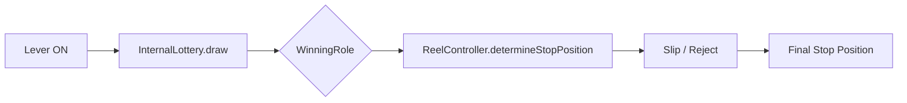

import { Meta } from '@storybook/blocks';

<Meta title="Docs/Internal Lottery & Reel Control" />

# Internal Lottery & Reel Control

Reeljs uses a two-stage draw architecture: **InternalLottery** determines the winning role, then **ReelController** controls reel stop positions.

## Architecture



## InternalLottery

- Draws a `WinningRole` based on `GameMode` and `DifficultyPreset`
- Manages `CarryOverFlag` for missed bonus wins
- Supports custom random functions

## ReelController

- **Slip**: Pulls the reel forward up to `SlipRange` (default 4) positions to land on the winning symbol
- **Reject**: Pushes the reel past non-winning symbols
- Supports `AutoStop` mode for random stop timing

## WinningRoleType

| Type | Description |
|------|-------------|
| `BONUS` | Bonus win (SBB / BB / RB) |
| `SMALL_WIN` | Small payout (cherry, bell, etc.) |
| `REPLAY` | Free re-spin |
| `MISS` | No win |

## Usage

```ts
import { InternalLottery, ReelController } from 'reeljs';

const lottery = new InternalLottery(config);
const role = lottery.draw('Normal');

const controller = new ReelController(reelConfig);
const result = controller.determineStopPosition(0, role, timing);
```
