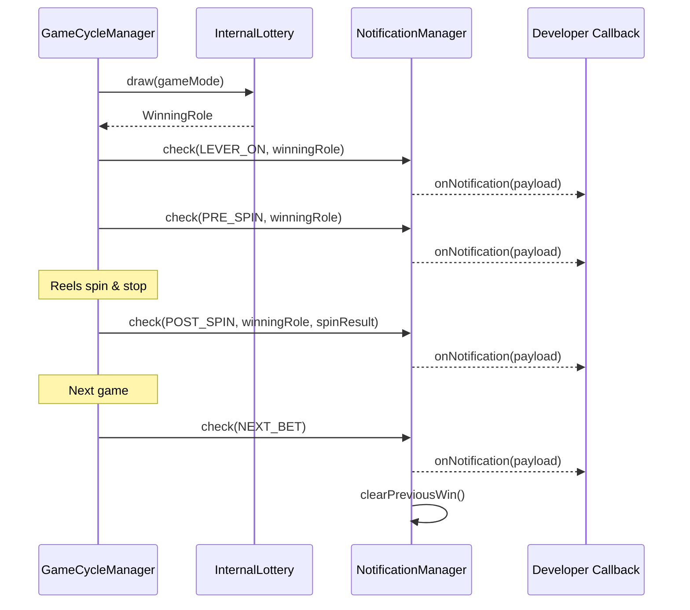

import { Meta } from '@storybook/blocks';

<Meta title="Docs/Notification Flow" />

# Notification Flow

`NotificationManager` handles win notification timing. It provides **logic and event firing only** — UI/animation/sound is left to the developer.

## Notification Types

| Type | Timing | Description |
|------|--------|-------------|
| `PRE_SPIN` | Before spin starts | Notify win before reels spin |
| `POST_SPIN` | After reels stop | Notify win after result confirmed |
| `NEXT_BET` | Next game BET | Notify previous game's win on next BET |
| `LEVER_ON` | Lever ON | Notify win at lever pull |

## Flow Diagram



## Usage

```tsx
import { useNotification } from 'reeljs';

const { status, lastPayload, acknowledgeNotification } = useNotification({
  enabledTypes: { PRE_SPIN: true, POST_SPIN: true },
  targetRoleTypes: ['BONUS'],
});
```
