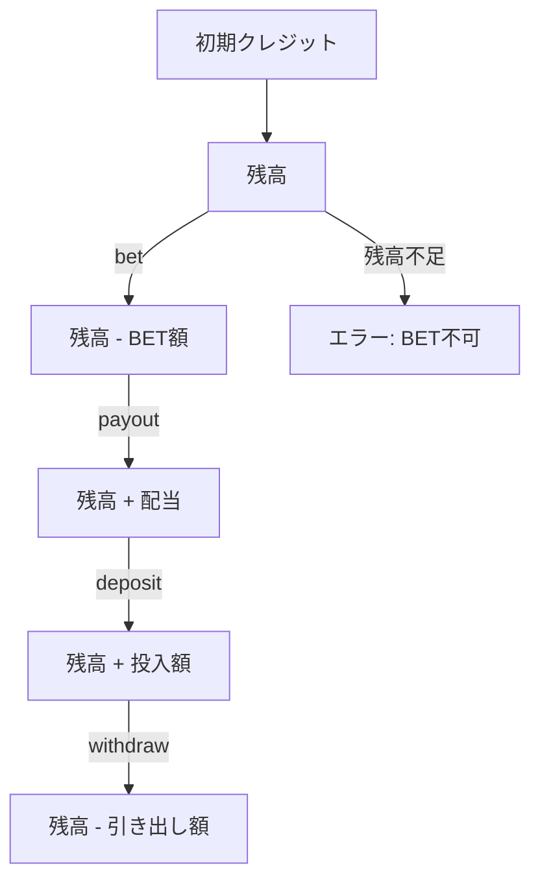

import { Meta } from '@storybook/blocks';

<Meta title="Docs（日本語）/クレジット管理" />

# クレジット管理

`CreditManager` はクレジット（メダル）の残高管理、BET消費、配当加算、投入・引き出しを担当します。

## 操作フロー



## BetConfig

| フィールド | 説明 |
|-----------|------|
| `initialCredit` | 初期クレジット額 |
| `betOptions` | BET額のバリエーション（例: `[1, 2, 3]`） |
| `defaultBet` | デフォルトBET額 |
| `historySize` | 変動履歴の保持件数 |

## 使用例

```tsx
import { useCredit } from 'reeljs';

const { balance, currentBet, canSpin, setBet, deposit, withdraw } = useCredit({
  initialCredit: 1000,
  betOptions: [1, 2, 3],
  defaultBet: 3,
});
```
