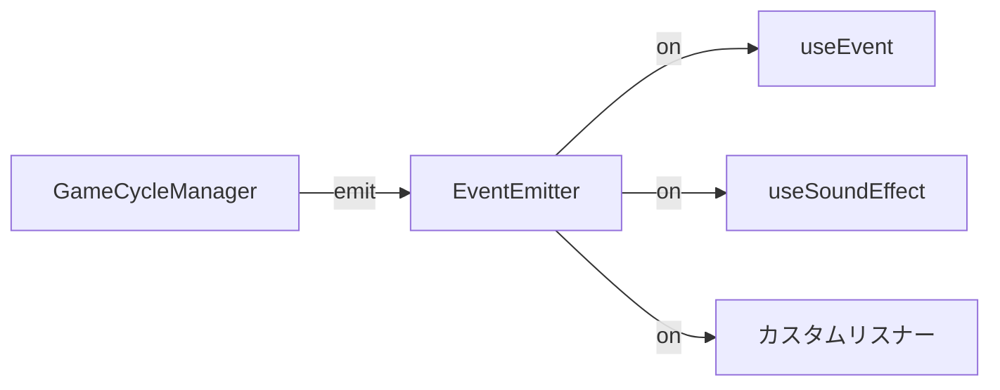

import { Meta } from '@storybook/blocks';

<Meta title="Docs（日本語）/イベントシステム" />

# イベントシステム

`EventEmitter` はモジュール間の疎結合な通信を実現するPub/Subイベントバスです。

## 標準イベント

| イベント | ペイロード | 発火タイミング |
|---------|----------|-------------|
| `spinStart` | — | スピン開始時 |
| `reelStop` | `{ reelIndex, position }` | リール停止時 |
| `win` | `{ payout, winLines }` | 当選検出時 |
| `bonusStart` | `{ bonusType }` | ボーナス開始時 |
| `modeChange` | `{ from, to }` | モード遷移時 |
| `zoneChange` | `{ from, to }` | ゾーン遷移時 |
| `phaseChange` | `{ from, to }` | フェーズ遷移時 |
| `creditChange` | `{ balance, delta }` | クレジット変動時 |
| `notification` | `NotificationPayload` | 告知発火時 |

## アーキテクチャ



## 使用例

```tsx
import { useEvent, EventEmitter } from 'reeljs';

// 直接使用
const emitter = new EventEmitter();
const unsub = emitter.on('win', (payload) => console.log(payload));
emitter.emit('win', { payout: 100 });
unsub();

// フック使用（アンマウント時に自動購読解除）
const { emit, on } = useEvent(emitter);
on('win', (payload) => { /* 処理 */ });
```
