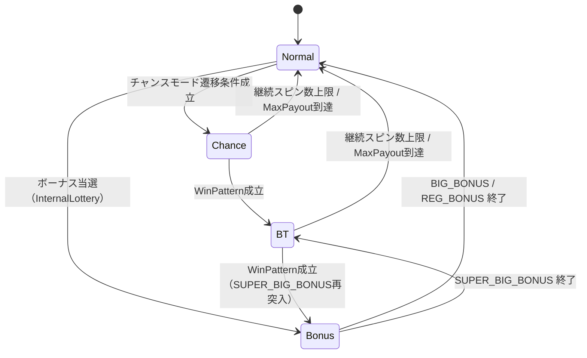

import { Meta } from '@storybook/blocks';

<Meta title="Docs（日本語）/ゲームモード遷移" />

# ゲームモード遷移

`GameModeManager` は4つのゲームモードを管理します: **Normal**（通常）、**Chance**（チャンス）、**Bonus**（ボーナス）、**BT**（ボーナストリガー）。

## 遷移図



## モード一覧

| モード | 突入条件 | 終了条件 |
|--------|---------|---------|
| Normal | ゲーム開始 / ボーナス終了 | Chance or Bonus 突入 |
| Chance | `normalToChance` 確率判定 | WinPattern → BT、または上限到達 |
| Bonus | InternalLottery BONUS当選 | 継続スピン数 or MaxPayout |
| BT | SUPER_BIG_BONUS終了 / Chance WinPattern | 継続スピン数 or MaxPayout |

## 使用例

```tsx
import { useGameMode } from 'reeljs';

const { currentMode, currentBonusType, remainingSpins } = useGameMode({
  transitionConfig: { normalToChance: 0.02, chanceTobt: 0.3, btToSuperBigBonus: 0.1 },
  bonusConfigs: { /* ... */ },
  btConfig: { maxSpins: 50, maxPayout: 500, winPatterns: [] },
  chanceConfig: { maxSpins: 20, maxPayout: 200, winPatterns: [] },
});
```
