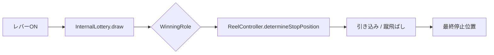

import { Meta } from '@storybook/blocks';

<Meta title="Docs（日本語）/内部抽選と出目制御" />

# 内部抽選と出目制御

Reeljsは2段階の抽選アーキテクチャを採用しています: **InternalLottery**（内部抽選）で当選役を決定し、**ReelController**（出目制御）でリール停止位置を制御します。

## アーキテクチャ



## InternalLottery

- `GameMode` と `DifficultyPreset` に応じて `WinningRole` を抽選
- `CarryOverFlag`（持ち越しフラグ）でボーナス取りこぼし時の持ち越しを管理
- カスタム乱数生成関数をサポート

## ReelController

- **引き込み（Slip）**: 当選役の出目を表示するため、停止位置を最大 `SlipRange`（デフォルト4）コマ先に進める
- **蹴飛ばし（Reject）**: 非当選役の出目を回避するため、停止位置をずらす
- **AutoStop**: 目押しなしでランダムタイミング停止

## 当選役種別

| 種別 | 説明 |
|------|------|
| `BONUS` | ボーナス当選（SBB / BB / RB） |
| `SMALL_WIN` | 小役（チェリー、ベル等） |
| `REPLAY` | リプレイ（再遊技） |
| `MISS` | ハズレ |

## 使用例

```ts
import { InternalLottery, ReelController } from 'reeljs';

const lottery = new InternalLottery(config);
const role = lottery.draw('Normal');

const controller = new ReelController(reelConfig);
const result = controller.determineStopPosition(0, role, timing);
```
