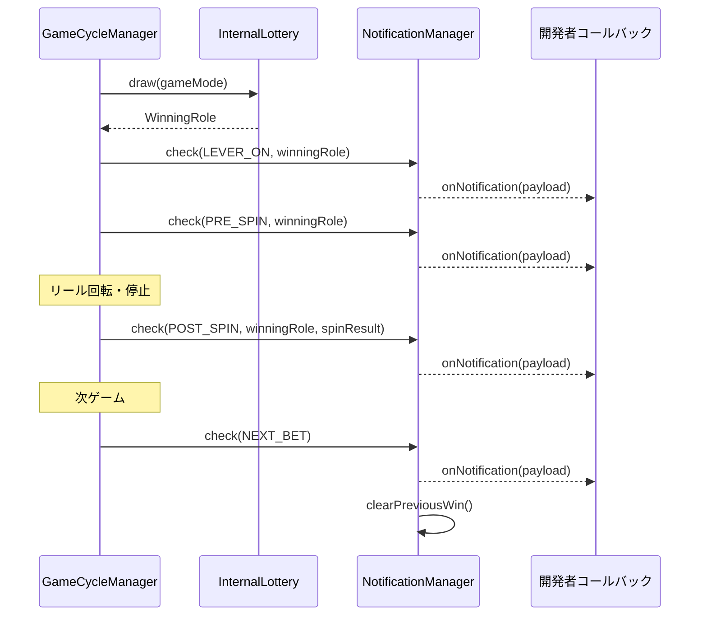

import { Meta } from '@storybook/blocks';

<Meta title="Docs（日本語）/告知フロー" />

# 告知フロー

`NotificationManager` は当選告知のタイミング判定を行います。**ロジックとイベント発火のみ**を担当し、演出（UI/アニメーション/サウンド）は開発者に委ねます。

## 告知タイプ

| タイプ | タイミング | 説明 |
|--------|----------|------|
| `PRE_SPIN` | スピン開始前 | 先告知 |
| `POST_SPIN` | リール停止後 | 後告知 |
| `NEXT_BET` | 次ゲームBET時 | 次ゲームBET告知 |
| `LEVER_ON` | レバーON時 | 自ゲームレバーON告知 |

## フロー図



## 使用例

```tsx
import { useNotification } from 'reeljs';

const { status, lastPayload, acknowledgeNotification } = useNotification({
  enabledTypes: { PRE_SPIN: true, POST_SPIN: true },
  targetRoleTypes: ['BONUS'],
});
```
